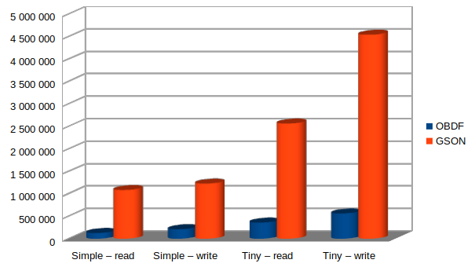

# Benchmark raport

- Benchmark version: 1.0.0
- Library verison: 2.0.0

## System

- CPU: Ryzen 3600
- RAM: 32GB DDR4 3200MHz

## Raw results

```console
Benchmark                        Mode  Cnt        Score       Error  Units
BinBenchmark.read_simple_bin    thrpt   20   125183.137 ±  1322.513  ops/s
BinBenchmark.read_simple_gson   thrpt   20  1083061.186 ±  9845.708  ops/s
BinBenchmark.read_tiny_bin      thrpt   20   356060.775 ±  3996.609  ops/s
BinBenchmark.read_tiny_gson     thrpt   20  2561906.315 ± 41305.017  ops/s
BinBenchmark.write_simple_bin   thrpt   20   208721.251 ±  3678.310  ops/s
BinBenchmark.write_simple_gson  thrpt   20  1225779.943 ± 28722.032  ops/s
BinBenchmark.write_tiny_bin     thrpt   20   560095.213 ± 11373.535  ops/s
BinBenchmark.write_tiny_gson    thrpt   20  4540438.009 ± 67602.501  ops/s
```

## Charts


